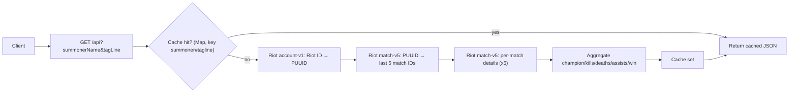

# League-CLI
> A League of Legends match-stats lookup tool that wraps the Riot Games API behind a single cached endpoint.

[GitHub](https://github.com/Banhhmii/League-CLI)

---

## The Problem

Riot's API doesn't expose a single endpoint for a player's recent-match summary. Getting a summoner's last few matches requires chaining three separate endpoint calls — Riot ID → PUUID, PUUID → match IDs, then a per-match detail call for each of those matches — up to 7 requests for one lookup. Doing that fan-out again every time someone searches the same summoner burns through Riot's rate limits fast.

## The Solution

A raw Node `http` server chains those three Riot endpoints server-side so the client only ever calls one internal route (`GET /api?summonerName=X&tagLine=Y`), then aggregates the results into per-match `{champion, kills, deaths, assists, win}` records. An in-memory `Map`, keyed by `summoner#tagline`, caches the aggregated result — a repeat lookup for the same summoner is served straight from the cache and skips the Riot API fan-out entirely.

---

## Architecture



On a cache miss, one lookup can cost up to 7 upstream Riot API calls (1 account + 1 match-list + 5 match-detail). The cache exists specifically to make that cost a one-time thing per summoner, not a per-request thing.

---

## Tech Stack

- **Backend:** Vanilla Node.js `http` module (no framework)
- **Frontend:** Vanilla HTML/CSS/JS
- **Other:** `dotenv`, Riot Games API

## Key Features

- Multi-endpoint Riot API orchestration collapsed behind one internal endpoint
- In-memory caching keyed by summoner name + tagline to avoid redundant, rate-limit-costly lookups
- Simple static frontend that renders match cards with champion splash art and KDA

---

## Setup (Run Locally)

### Prerequisites
- Node.js v18+
- A Riot Games API key (from the Riot Developer Portal)

### Installation

Clone the repo
```
git clone https://github.com/Banhhmii/League-CLI.git
cd League-CLI
```

Install dependencies
```
npm install
```

Set up environment variables
```
cp .env.example .env
# Then edit .env with your Riot API key
```

Start the server
```
node server.js
```

Visit `http://localhost:3000`

### Environment Variables

See `.env.example` for the full list. You'll need:
- `RIOT_API_KEY` — required, sent as the `X-Riot-Token` header on every Riot API call
- `PORT` — optional, defaults to 3000

---

## What I Learned

- Building the backend on the raw `http` module instead of Express forced me to actually understand what a framework abstracts away — routing, static file serving, and response handling all had to be written by hand instead of assumed.
- The in-memory `Map` cache is honest about its own limits: it's the right fit for a single-process dev tool, but it has no TTL or eviction, so that scope/invalidation trade-off is future work, not something I'm pretending is already solved.
- Fixed a real bug where a summoner's results wouldn't render after a prior 404 — the frontend's `resultsDiv` was declared `const`, so it could never be reassigned once a "Summoner not found" state had been written into it, even on a later successful search.

## Credits

Built by Tommy Ngo as part of my self-taught journey into software engineering.

- https://banhhmii.github.io
- https://www.linkedin.com/in/tommy-ngo1
